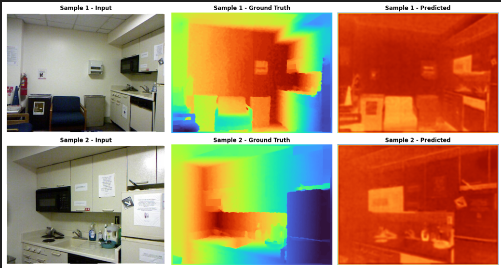

# Monocular Depth Estimation (MDE) Project

A Deep Learning project for monocular depth estimation using the NYU Depth v2 dataset.

## Features

- Uses NYU Depth v2 dataset via Kaggle Hub (no local download required)
- PyTorch-based implementation
- Streamable dataset loading
- Training and evaluation pipeline
- TensorBoard logging support

## Project Structure

```
mde_project/
├── src/
│   ├── __init__.py
│   ├── dataset.py          # NYU Depth v2 dataset loader
│   ├── models.py           # Depth estimation models
│   ├── train.py            # Training script
│   ├── evaluate.py         # Evaluation script
│   └── utils.py            # Utility functions
├── notebooks/
│   └── exploration.ipynb   # Data exploration and visualization
├── configs/
│   └── config.yaml         # Configuration file
├── requirements.txt
└── README.md
```

## Setup

1. Install dependencies:
```bash
pip install -r requirements.txt
```

## Dataset

The project uses the **NYU Depth v2 dataset** available on Kaggle:
- Dataset: https://www.kaggle.com/datasets/soumikrakshit/nyu-depth-v2

The dataset is accessed through kagglehub without downloading locally.

## Usage

### Quick Training (Recommended for Testing)
Fast training with 5 epochs on a small subset (5,000 samples):
```bash
python quick_train.py
```
Estimated runtime: **30-45 minutes on CPU**

### Full Training
Complete training with 20 epochs on all 50,688 samples:
```bash
python src/train.py --config configs/config.yaml
```
Estimated runtime: **4-6 hours on CPU**

### Evaluation
Evaluate trained model and generate visualizations:
```bash
python src/evaluate.py --model outputs/best_model.pth --save-viz
```

### Exploration
Open and run `notebooks/exploration.ipynb` for data visualization.

## Requirements

- Python 3.8+
- PyTorch 2.1+
- CUDA-enabled GPU (recommended)

## Evaluation Metrics

The model is evaluated using standard depth estimation metrics:

### Mean Absolute Error (MAE)
$$\text{MAE} = \frac{1}{N} \sum_{i=1}^{N} |y_i - \hat{y}_i|$$

Where:
- $N$ = number of pixels
- $y_i$ = ground truth depth
- $\hat{y}_i$ = predicted depth

### Root Mean Square Error (RMSE)
$$\text{RMSE} = \sqrt{\frac{1}{N} \sum_{i=1}^{N} (y_i - \hat{y}_i)^2}$$

### Delta Accuracy
$$\delta_\tau = \frac{\#\text{ pixels where } \max(y_i/\hat{y}_i, \hat{y}_i/y_i) < \tau}{N} \times 100\%$$

Typically computed for $\tau = 1.25, 1.25^2, 1.25^3$

These metrics measure:
- **MAE**: Average absolute difference in depth (in meters)
- **RMSE**: Penalizes larger errors more heavily
- **Delta**: Percentage of pixels within a threshold ratio

## Notes

- The dataset is streamed from Kaggle Hub, no local storage required
- Training uses PyTorch DataLoader for efficient batch processing
- Results are logged to TensorBoard


This project is for educational purposes.

